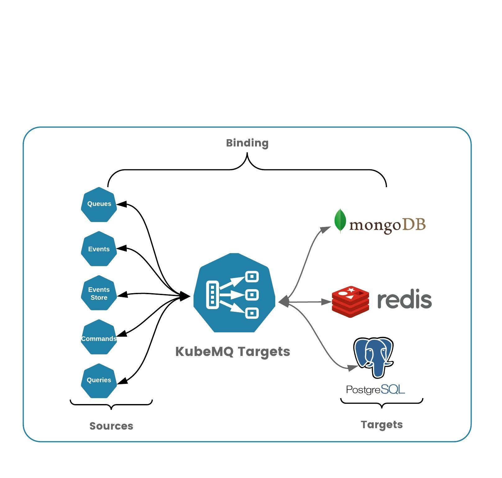
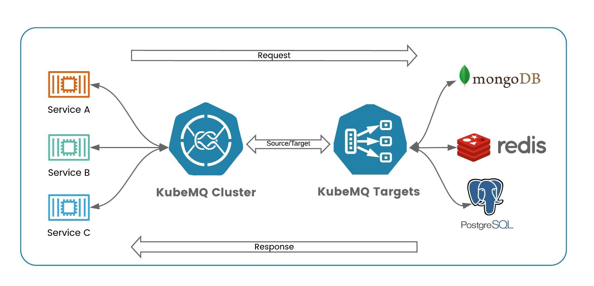

# KubeMQ Targets

KubeMQ Targets connects KubeMQ Message Broker with external systems and cloud services.

KubeMQ Targets allows us to build a message-based microservices architecture on Kubernetes with minimal efforts and without developing connectivity interfaces between KubeMQ Message Broker and external systems such as databases, cache, messaging, and REST-base APIs.

**Key Features**:

- **Runs anywhere**  - Kubernetes, Cloud, on-prem, anywhere
- **Stand-alone** - small docker container / binary
- **Single Interface** - One interface all the services
- **Any Service** - Support all major services types (databases, cache, messaging, serverless, HTTP, etc.)
- **Plug-in Architecture** Easy to extend, easy to connect
- **Middleware Supports** - Logs, Metrics, Retries, and Rate Limiters
- **Easy Configuration** - simple yaml file builds your topology

## Concepts

KubeMQ Targets building blocks are:
 - Binding
 - Source
 - Target
 - Request/Response

### Binding

Binding is a 1:1 connection between Source and Target. Every Binding runs independently.



### Target

Target is an external service that exposes an API allowing to interact and serve his functionalists with other services.

Targets can be Cache systems such as Redis and Memcached, SQL Databases such as Postgres and MySql, and even an HTTP generic Rest interface.

KubeMQ Targets integrate each one of the supported targets and service requests based on the request data.

A list of supported targets is below.

#### Standalone Services

| Category   | Target                                                              | Kind                         | Configuration                                      | Example                                 |
|:-----------|:--------------------------------------------------------------------|:-----------------------------|:---------------------------------------------------|:----------------------------------------|
| Cache      |                                                                     |                              |                                                    |                                         |
|            | [Redis](https://redis.io/)                                          |cache.redis           | [Usage](targets/cache/redis)                       | [Example](examples/cache/redis)         |
|            | [Memcached](https://memcached.org/)                                 |cache.memcached       | [Usage](targets/cache/memcached)                   | [Example](examples/cache/memcached)    |
| Stores/db  |                                                                     |                              |                                                    |                                         |
|            | [Postgres](https://www.postgresql.org/)                             |stores.postgres       | [Usage](targets/stores/postgres)                   | [Example](examples/stores/postgres)     |
|            | [Mysql](https://www.mysql.com/)                                     |stores.mysql          | [Usage](targets/stores/mysql)                      | [Example](examples/stores/mysql)        |
|            | [MSSql](https://www.microsoft.com/en-us/sql-server/sql-server-2019) |stores.mssql          | [Usage](targets/stores/mssql)                      | [Example](examples/stores/mssql)        |
|            | [MongoDB](https://www.mongodb.com/)                                 |stores.mongodb        | [Usage](targets/stores/mongodb)                    | [Example](examples/stores/mongodb)      |
|            | [Elastic Search](https://www.elastic.co/)                           |stores.elastic-search | [Usage](targets/stores/elastic)                    | [Example](examples/stores/elastic)      |
|            | [Cassandra](https://cassandra.apache.org/)                          |stores.cassandra      | [Usage](targets/stores/cassandra)                  | [Example](examples/stores/cassandra)    |
|            | [Couchbase](https://www.couchbase.com/)                             |stores.couchbase      | [Usage](targets/stores/couchbase)                  | [Example](examples/stores/couchbase)    |
| Messaging  |                                                                     |                              |                                                    |                                         |
|            | [Kafka](https://kafka.apache.org/)                                  |messaging.kafka       | [Usage](targets/messaging/kafka)                   | [Example](examples/messaging/kafka)     |
|            | [Nats](https://nats.io/)                                            |messaging.nats        | [Usage](targets/messaging/nats)                    | [Example](examples/messaging/nats)     |
|            | [RabbitMQ](https://www.rabbitmq.com/)                               |messaging.rabbitmq    | [Usage](targets/messaging/rabbitmq)                | [Example](examples/messaging/rabbitmq)  |
|            | [MQTT](http://mqtt.org/)                                            |messaging.mqtt        | [Usage](targets/messaging/mqtt)                    | [Example](examples/messaging/mqtt)      |
|            | [ActiveMQ](http://activemq.apache.org/)                             |messaging.activemq    | [Usage](targets/messaging/activemq)                | [Example](examples/messaging/activemq)  |
|            | [IBM-MQ](https://developer.ibm.com/components/ibm-mq)               |messaging.ibmmq    | [Usage](targets/messaging/ibmmq)                   | [Example](examples/messaging/ibmmq)  |
| Storage    |                                                                     |                              |                                                    |                                         |
|            | [Minio/S3](https://min.io/)                                         |storage.minio         | [Usage](targets/storage/minio)                     | [Example](examples/storage/minio)       |
| Serverless |                                                                     |                              |                                                    |                                         |
|            | [OpenFaas](https://www.openfaas.com/)                               |serverless.openfaas   | [Usage](targets/serverless/openfass)               | [Example](examples/serverless/openfaas) |
| Http       |                                                                     |                              |                                                    |                                         |
|            | Http                                                                |http                  | [Usage](targets/http)                              | [Example](examples/http)                |


#### Google Cloud Platform (GCP)

| Category   | Target                                                              | Kind                       | Configuration                              | Example                                       |
|:-----------|:--------------------------------------------------------------------|:---------------------------|:-------------------------------------------|:----------------------------------------------|
| Cache      |                                                                     |                            |                                            |                                               |
|            | [Redis](https://cloud.google.com/memorystore)                       |gcp.cache.redis     | [Usage](targets/gcp/memorystore/redis)     | [Example](examples/gcp/memorystore/redis)     |
|            | [Memcached](https://cloud.google.com/memorystore)                   |gcp.cache.memcached | [Usage](targets/gcp/memorystore/memcached) | [Example](examples/gcp/memorystore/memcached) |
| Stores/db  |                                                                     |                            |                                            |                                               |
|            | [Postgres](https://cloud.google.com/sql)                            |gcp.stores.postgres | [Usage](targets/gcp/sql/postgres)          | [Example](examples/gcp/sql/postgres)           |
|            | [Mysql](https://cloud.google.com/sql)                               |gcp.stores.mysql    | [Usage](targets/gcp/sql/mysql)             | [Example](examples/gcp/sql/mysql)              |
|            | [BigQuery](https://cloud.google.com/bigquery)                       |gcp.bigquery        | [Usage](targets/gcp/bigquery)              | [Example](examples/gcp/bigquery)               |
|            | [BigTable](https://cloud.google.com/bigtable)                       |gcp.bigtable        | [Usage](targets/gcp/bigtable)              | [Example](examples/gcp/bigtable)               |
|            | [Firestore](https://cloud.google.com/firestore)                     |gcp.firestore       | [Usage](targets/gcp/firestore)             | [Example](examples/gcp/firestore)              |
|            | [Spanner](https://cloud.google.com/spanner)                         |gcp.spanner         | [Usage](targets/gcp/spanner)               | [Example](examples/gcp/spanner)                |
|            | [Firebase](https://firebase.google.com/products/realtime-database/) |gcp.firebase        | [Usage](targets/gcp/firebase)              | [Example](examples/gcp/firebase)               |
| Messaging  |                                                                     |                            |                                            |                                               |
|            | [Pub/Sub](https://cloud.google.com/pubsub)                          |gcp.pubsub          | [Usage](targets/gcp/pubsub)                | [Example](examples/gcp/pubsub)                 |
| Storage    |                                                                     |                            |                                            |                                               |
|            | [Storage](https://cloud.google.com/storage)                         |gcp.storage         | [Usage](targets/gcp/storage)               | [Example](examples/gcp/storage)                |
| Serverless |                                                                     |                            |                                            |                                               |
|            | [Functions](https://cloud.google.com/functions)                     |gcp.cloudfunctions  | [Usage](targets/gcp/cloudfunctions)        | [Example](examples/gcp/cloudfunctions)         |
|            |                                                                     |                            |                                            |                                               |


#### Amazon Web Service (AWS)


| Category   | Target                                                         | Kind                            | Configuration                           | Example                                    |
|:-----------|:---------------------------------------------------------------|:--------------------------------|:----------------------------------------|:-------------------------------------------|
| Stores/db  |                                                                |                                 |                                         |                                            |
|            | [Athena](https://docs.aws.amazon.com/athena)                   |aws.athena               | [Usage](targets/aws/athena)             | [Example](examples/aws/athena)             |
|            | [DynamoDB](https://aws.amazon.com/dynamodb/)                   |aws.dynamodb             | [Usage](targets/aws/dynamodb)           | [Example](examples/aws/dynamodb)           |
|            | [Elasticsearch](https://aws.amazon.com/elasticsearch-service/) |aws.elasticsearch        | [Usage](targets/aws/elasticsearch)      | [Example](examples/aws/elasticsearch)      |
|            | [KeySpaces](https://docs.aws.amazon.com/keyspaces)             |aws.keyspaces            | [Usage](targets/aws/keyspaces)          | [Example](examples/aws/keyspaces)          |
|            | [MariaDB](https://aws.amazon.com/rds/mariadb/)                 |aws.rds.mariadb          | [Usage](targets/aws/rds/mariadb)        | [Example](examples/aws/rds/mariadb)        |
|            | [MSSql](https://aws.amazon.com/rds/sqlserver/)                 |aws.rds.mssql            | [Usage](targets/aws/rds/mssql)          | [Example](examples/aws/rds/mssql)          |
|            | [MySQL](https://aws.amazon.com/rds/mysql/)                     |aws.rds.mysql            | [Usage](targets/aws/rds/mysql)          | [Example](examples/aws/rds/mysql)          |
|            | [Postgres](https://aws.amazon.com/rds/postgresql/)             |aws.rds.postgres         | [Usage](targets/aws/rds/postgres)       | [Example](examples/aws/rds/postgres)       |
|            | [RedShift](https://aws.amazon.com/redshift/)                   |aws.rds.redshift         | [Usage](targets/aws/rds/redshift)       | [Example](examples/aws/rds/redshift)       |
|            | [RedShiftSVC](https://aws.amazon.com/redshift/)                |aws.rds.redshift.service | [Usage](targets/aws/redshift)           | [Example](examples/aws/redshift)           |
| Messaging  |                                                                |                                 |                                         |                                            |
|            | [AmazonMQ](https://aws.amazon.com/amazon-mq/)                  |aws.amazonmq             | [Usage](targets/aws/amazonmq)           | [Example](examples/aws/amazonmq)           |
|            | [msk](https://aws.amazon.com/msk/)                             |aws.msk                  | [Usage](targets/aws/msk)                | [Example](examples/aws/msk)                |
|            | [Kinesis](https://aws.amazon.com/kinesis/)                     |aws.kinesis              | [Usage](targets/aws/kinesis)            | [Example](examples/aws/kinesis)            |
|            | [SQS](https://aws.amazon.com/sqs/)                             |aws.sqs                  | [Usage](targets/aws/sqs)                | [Example](examples/aws/sqs)                |
|            | [SNS](https://aws.amazon.com/sns/)                             |aws.sns                  | [Usage](targets/aws/sns)                | [Example](examples/aws/sns)                |
| Storage    |                                                                |                                 |                                         |                                            |
|            | [s3](https://aws.amazon.com/s3/)                               |aws.s3                   | [Usage](targets/aws/s3)                 | [Example](examples/aws/s3)                 |
| Serverless |                                                                |                                 |                                         |                                            |
|            | [lambda](https://aws.amazon.com/lambda/)                       |aws.lambda               | [Usage](targets/aws/lambda)             | [Example](examples/aws/lambda)             |
| Other      |                                                                |                                 |                                         |                                            |
|            | [Cloud Watch](https://aws.amazon.com/cloudwatch/)              |aws.cloudwatch.logs      | [Usage](targets/aws/cloudwatch/logs)    | [Example](examples/aws/cloudwatch/logs)    |
|            | [Cloud Watch](https://aws.amazon.com/cloudwatch/)              |aws.cloudwatch.events    | [Usage](targets/aws/cloudwatch/events)  | [Example](examples/aws/cloudwatch/events)  |
|            | [Cloud Watch](https://aws.amazon.com/cloudwatch/)              |aws.cloudwatch.metrics   | [Usage](targets/aws/cloudwatch/metrics) | [Example](examples/aws/cloudwatch/metrics) |


#### Microsoft Azure

| Category   | Target                                                                | Kind                         | Configuration                          | Example                                  |
|:-----------|:----------------------------------------------------------------------|:-----------------------------|:---------------------------------------|:-----------------------------------------|
| Stores/db  |                                                                       |                              |                                        |                                          |
|            | [Azuresql](https://docs.microsoft.com/en-us/azure/mysql/)             |azure.stores.azuresql | [Usage](targets/azure/stores/azuresql) | [Example](examples/azure/store/azuresql) |
|            | [Mysql](https://aws.amazon.com/dynamodb/)                             |azure.stores.mysql    | [Usage](targets/azure/stores/mysql)    | [Example](examples/azure/store/mysql)    |
|            | [Postgres](https://azure.microsoft.com/en-us/services/postgresql/)    |azure.stores.postgres | [Usage](targets/azure/stores/postgres) | [Example](examples/azure/store/postgres) |
| Storage    |                                                                       |                              |                                        |                                          |
|            | [Blob](https://azure.microsoft.com/en-us/services/storage/blobs/)     |azure.storage.blob    | [Usage](targets/azure/storage/blob)    | [Example](examples/azure/storage/blob)   |
|            | [Files](https://azure.microsoft.com/en-us/services/storage/files/)    |azure.storage.files   | [Usage](targets/azure/storage/files)   | [Example](examples/azure/storage/files)  |
|            | [Queue](https://docs.microsoft.com/en-us/azure/storage/queues/)       |azure.storage.queue           | [Usage](targets/azure/storage/queue)   | [Example](examples/azure/storage/queue)  |
| EventHubs  |                                                                       |                              |                                        |                                          |
|            | [EventHubs](https://azure.microsoft.com/en-us/services/event-hubs/)   |azure.eventhubs       | [Usage](targets/azure/eventhubs)       | [Example](examples/azure/eventhubs)      |
| ServiceBus |                                                                       |                              |                                        |                                          |
|            | [ServiceBus](https://azure.microsoft.com/en-us/services/service-bus/) |azure.servicebus      | [Usage](targets/azure/servicebus)      | [Example](examples/azure/servicebus)     |


### Source

The source is a KubeMQ connection (in subscription mode), which listens to requests from services and route them to the appropriate target for action, and return back a response if needed.

KubeMQ Targets supports all of KubeMQ's messaging patterns: Queue, Events, Events-Store, Command, and Query.


| Type                                                                              | Kind                | Configuration                           |
|:----------------------------------------------------------------------------------|:--------------------|:----------------------------------------|
| [Queue](https://docs.kubemq.io/learn/message-patterns/queue)                      | kubemq.queue        | [Usage](sources/queue/README.md)        |
| [Events](https://docs.kubemq.io/learn/message-patterns/pubsub#events)             | kubemq.events       | [Usage](sources/events/README.md)       |
| [Events Store](https://docs.kubemq.io/learn/message-patterns/pubsub#events-store) | kubemq.events-store | [Usage](sources/events-store/README.md) |
| [Command](https://docs.kubemq.io/learn/message-patterns/rpc#commands)             | kubemq.command      | [Usage](sources/command/README.md)      |
| [Query](https://docs.kubemq.io/learn/message-patterns/rpc#queries)                | kubemq.query        | [Usage](sources/query/README.md)        |


### Request / Response



#### Request

A request is an object that sends to a designated target with metadata and data fields, which contains the needed information to perform the requested data.

##### Request Object Structure

| Field    | Type                  | Description                              |
|:---------|:----------------------|:-----------------------------------------|
| metadata | string, string object | contains metadata information for action |
| data     | bytes array           | contains raw data for action             |


##### Example

Request to get a data from Redis cache for the key "log"
```json
{
  "metadata": {
    "method": "get",
    "key": "log"
  },
  "data": null
}
```
#### Response
The response is an object that sends back as a result of executing an action in the target


##### Response Object Structure

| Field    | Type                 | Description                                     |
|:---------|:---------------------|:------------------------------------------------|
| metadata | string, string object | contains metadata information result for action |
| data     | bytes array          | contains raw data result                        |
| is_error | bool                 | indicate if the action ended with an error      |
| error    | string               | contains error information if any               |


##### Example

Response received on request to get the data stored in Redis for key "log"
```json
{
  "metadata": {
    "result": "ok",
    "key": "log"
  },
  "data": "SU5TRVJUIElOVE8gcG9zdChJRCxUSVRMRSxDT05URU5UKSBWQUxVRVMKCSAgICAgICAgICAgICAgICAgICAgICA"
}
```

## Installation

### Kubernetes

1. Install KubeMQ Cluster

```bash
kubectl apply -f https://get.kubemq.io/deploy
```

2. Run Redis Cluster deployment yaml

```bash
kubectl apply -f https://raw.githubusercontent.com/kubemq-hub/kubemq-targets/master/redis-example.yaml
```

2. Run KubeMQ Targets deployment yaml

```bash
kubectl apply -f https://raw.githubusercontent.com/kubemq-hub/kubemq-targets/master/deploy-example.yaml
```

### Binary (Cross-platform)

Download the appropriate version for your platform from KubeMQ Targets Releases. Once downloaded, the binary can be run from anywhere.

Ideally, you should install it somewhere in your PATH for easy use. /usr/local/bin is the most probable location.

Running KubeMQ Targets

```bash
./kubemq-targets --config config.yaml
```

## Configuration

### Structure

Config file structure:

```yaml

apiPort: 8080 # kubemq targets api and health end-point port
bindings:
  - name: clusters-sources # unique binding name
    properties: # Bindings properties such middleware configurations
      log_level: error
      retry_attempts: 3
      retry_delay_milliseconds: 1000
      retry_max_jitter_milliseconds: 100
      retry_delay_type: "back-off"
      rate_per_second: 100
    source:
      kind: kubemq.query # source kind
      name: name-of-sources # source name 
      properties: # a set of key/value settings per each source kind
        .....
    target:
      kind:cache.redis # target kind
      name: name-of-target # targets name
      properties: # a set of key/value settings per each target kind
        - .....
```

### Build Wizard 

KubeMQ Targets configuration can be build with --build flag

```
./kubemq-targets --build
```

### Properties

In bindings configuration, KubeMQ targets support properties setting for each pair of source and target bindings.

These properties contain middleware information settings as follows:

#### Logs Middleware

KubeMQ targets support level based logging to console according to as follows:

| Property  | Description       | Possible Values        |
|:----------|:------------------|:-----------------------|
| log_level | log level setting | "debug","info","error" |
|           |                   |  "" - indicate no logging on this bindings |

An example for only error level log to console:

```yaml
bindings:
  - name: sample-binding 
    properties: 
      log_level: error
    source:
    ......  
```

#### Retry Middleware

KubeMQ targets support Retries' target execution before reporting of error back to the source on failed execution.

Retry middleware settings values:


| Property                      | Description                                           | Possible Values                             |
|:------------------------------|:------------------------------------------------------|:--------------------------------------------|
| retry_attempts                | how many retries before giving up on target execution | default - 1, or any int number              |
| retry_delay_milliseconds      | how long to wait between retries in milliseconds      | default - 100ms or any int number           |
| retry_max_jitter_milliseconds | max delay jitter between retries                      | default - 100ms or any int number           |
| retry_delay_type              | type of retry delay                                   | "back-off" - delay increase on each attempt |
|                               |                                                       | "fixed" - fixed time delay                  |
|                               |                                                       | "random" - random time delay                |

An example for 3 retries with back-off strategy:

```yaml
bindings:
  - name: sample-binding 
    properties: 
      retry_attempts: 3
      retry_delay_milliseconds: 1000
      retry_max_jitter_milliseconds: 100
      retry_delay_type: "back-off"
    source:
    ......  
```

#### Rate Limiter Middleware

KubeMQ targets support a Rate Limiting of target executions.

Rate Limiter middleware settings values:


| Property        | Description                                    | Possible Values                |
|:----------------|:-----------------------------------------------|:-------------------------------|
| rate_per_second | how many executions per second will be allowed | 0 - no limitation              |
|                 |                                                | 1 - n integer times per second |

An example for 100 executions per second:

```yaml
bindings:
  - name: sample-binding 
    properties: 
      rate_per_second: 100
    source:
    ......  
```

### Source

Source section contains source configuration for Binding as follows:

| Property    | Description                                       | Possible Values                                               |
|:------------|:--------------------------------------------------|:--------------------------------------------------------------|
| name        | sources name (will show up in logs)               | string without white spaces                                   |
| kind        | source kind type                                  | kubemq.queue                                                  |
|             |                                                   | kubemq.query                                                  |
|             |                                                   | kubemq.command                                                |
|             |                                                   | kubemq.events                                                 |
|             |                                                   | kubemq.events-store                                           |
| properties | an array of key/value setting for source connection| see above               |


### Target

Target section contains the target configuration for Binding as follows:

| Property    | Description                                       | Possible Values                                               |
|:------------|:--------------------------------------------------|:--------------------------------------------------------------|
| name        | targets name (will show up in logs)               | string without white spaces                                   |
| kind        | source kind type                                  |type-of-target                                                  |
| properties | an array of key/value set for target connection | see above              |


